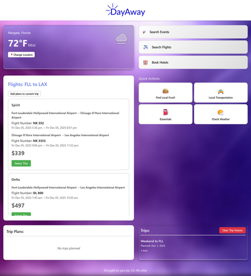

# DayAway

**Your ultimate Travel Planning Companion**

## Description

DayAway is a comprehensive travel discovery platform that helps you plan the perfect getaway. Whether you're looking for a weekend escape or an extended vacation, DayAway brings together everything you need in one place—from flights and hotels to local events and experiences.

## Overview

Planning travel can be overwhelming with information scattered across dozens of websites and apps. DayAway simplifies this by aggregating flights, accommodations, events, activities, and more into a single, intuitive platform. Discover what's happening at your destination, find the best deals on lodging all without switching between multiple services.

## Features

- **Flight Search** - Compare prices across airlines and find the best routes for your journey
- **Hotel Discovery** - Browse accommodations from budget-friendly stays to luxury resorts
- **Event Finder** - Discover concerts, festivals and local happenings at your destination
- **Itinerary Builder** - Create and organize your day-by-day travel plans
- **Weather Insights** - Access weather information for your destination

## Screenshot

## Getting Started

1. Clone the repository
2. Replace the api keys with your own
3. Style however you would like
4. In a terminal, navigate to the server folder, and run `node server.js`
5. Point the browser to `http://localhost:3000/index.html`

## Technologies Incorporated

- Node.js
- HTML5
- CSS3
- Javascript
- SerpApi
- WeatherAPI
